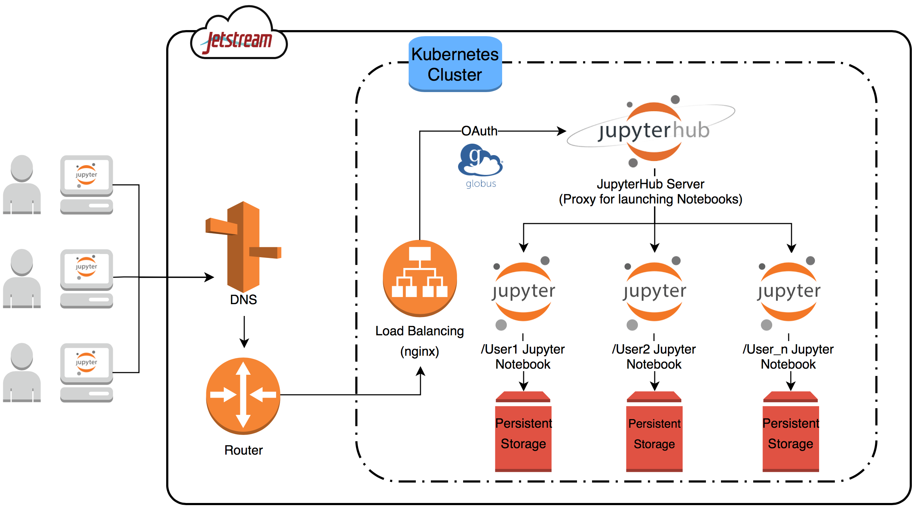

# Scaling JupyterHub on Jetstream

JupyterHub service for user training and next-generation workforce development for the geosciences. This platform provides users easy access via Globus authentication to interactive Jupyter notebooks. These notebooks are pre-configured with Unidata Python libraries, geoscience APIs and analysis and visualization tools.



### Presentations/Publications ###
S. Sarajlic, J. Chastang, S. Marru, J. Fischer, M. Lowe. 2018. Scaling JupyterHub using Kubernetes on XSEDE’s Jetstream: Platform as a service for research and educational initiatives in the Atmospheric Sciences. In Proceedings of the Practice and Experience in Advanced Research Computing 2017, Pittsburgh, Pennsylvania USA, July 2018, 4 pages. https://doi.org/10.1145/3219104.3229249

### How do I setup JupyterHub with Kubernetes ###
[Setup the OpenStack CLI Environment](https://iujetstream.atlassian.net/wiki/spaces/JWT/pages/40796180/Installing+the+Openstack+clients+on+OS+X) 

* Each time you are resuming your session you will need to source the following in order to use the OpenStack CLI:

```Bash
source <path_to_Project_directory>/jetstream/bin/activate
source cred/<Name_Of_The_Key_File>
```

Create VMs by running [createInstance.sh](createInstance.sh) wrapper
```Bash
# from the directory where createInstance.sh is located, run
./createInstance.sh <JetstreamNode1>

# to check your new VM status, run the following
openstack server list

```

Setup storage volume on the VM that will be used for persitent storage
```Bash
mkdir /data
fdisk -l /dev/sdb
mkfs.ext4 /dev/sdb
mount /dev/sdb /data
```

Deploy Kubernetes using the [Yuvi Panda's](https://github.com/data-8/kubeadm-bootstrap) documentation
 
```Bash
# get kubeadm-bootstrap
git clone https://github.com/data-8/kubeadm-bootstrap

# install master K8
cd kubeadm-bootstrap
sudo ./init-master.bash

# test master deployed
sudo kubectl get nodes
```

To add more nodes to the Kubernetes cluster, on the new VM, run the following after cloning the kubeadmn-bootstrap

```Bash
./install-kubeadm.bash

# on the *MASTER* node run, the following
sudo kubeadm token create --print-join-command

# copy the kubeadm-join command from master and run on the new VM
sudo kubeadm join --token <XXXXXX> --discovery-token-ca-cert-hash <XXXXXX>
```

Refer to [Andrea Zonca's](https://zonca.github.io/2017/12/scalable-jupyterhub-kubernetes-jetstream.html) for detailed documentation on seting up Rook for persistent storage

```Bash
sudo helm repo add rook-alpha https://charts.rook.io/alpha
sudo helm install rook-alpha/rook

#check storage/rook status
kubectl --namespace default get pods -l "app=rook-operator"
sudo kubectl get pods
```

Create Rook directory and add the [rook-cluster.yaml](rook-cluster.yaml) and [rook-storageclass.yaml](rook-storageclass.yaml) 

```Bash
sudo kubectl create -f rook-cluster.yaml

# test rook 
sudo kubectl -n rook get pods

sudo kubectl create -f rook-storageclass.yaml

# test/check storage class
sudo kubectl get storageclass
```

Setup kube-lego for https with the following [config_kube-lego_helm.yaml](config_kube-lego_helm.yaml)

```Bash
sudo helm install stable/kube-lego --namespace=support --name=lego -f config_kube-lego_helm.yaml

# test kube-lego
sudo kubectl get pods -n support
sudo kubectl logs -n support lego-kube-lego-XXXXX-XXXXX
```

Setup JupyterHub from Helm with the following [config_jupyterhub.yaml](config_jupyterhub.yaml)
```Bash
sudo helm repo add jupyterhub https://jupyterhub.github.io/helm-chart/
sudo helm repo update

# create to keys
openssl rand -hex 32
openssl rand -hex 32

sudo helm install jupyterhub/jupyterhub --version=v0.6 --name=atm-jupyterhub --namespace=atm-jupyterhub -f config_jupyterhub.yaml

# check on the hub and proxy
kubectl --namespace=atm-jupyterhub get pod
kubectl --namespace=atm-jupyterhub get svc proxy-public

#details about the hub
kubectl --namespace=atm-jupyterhub describe pod hub-XXXXX-XXXXX

# after updating the jupyterhub config
sudo helm upgrade atm-jupyterhub jupyterhub/jupyterhub -f config_jupyterhub.yaml
```

### How to deploy and scale Kubernetes cluster using Magnum ###

Deploying Kubernetes cluster

```Bash
magnum cluster-template-create --keypair YOUR-API-key --coe kubernetes \
--name kubernetes_cluster --external-network-id public --image \
fedora-atomic-ocata --flavor m1.small --master-flavor m1.small \
--volume-driver cinder --fixed-network OS_ssemir-api-net --fixed-subnet \
OS_ssemir-api-subnet1 --network-driver flannel --docker-volume-size 10 \
--docker-storage-driver overlay --floating-ip-enabled
```

Adding node to cluster
```Bash
magnum bay-create --name k8_jupyter_cluster --baymodel k8_cluster --node-count 1
```

Updating nodes for cluster
```Bash
magnum bay-update kubernetes_cluster replace node_count=3
```

Useful commands for checking on the cluster
```Bash
magnum baymodel-list
magnum bay-list
magnum cluster-show xxxx
```


