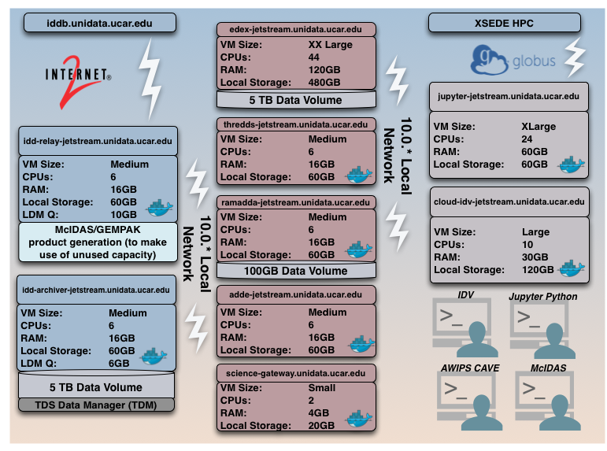
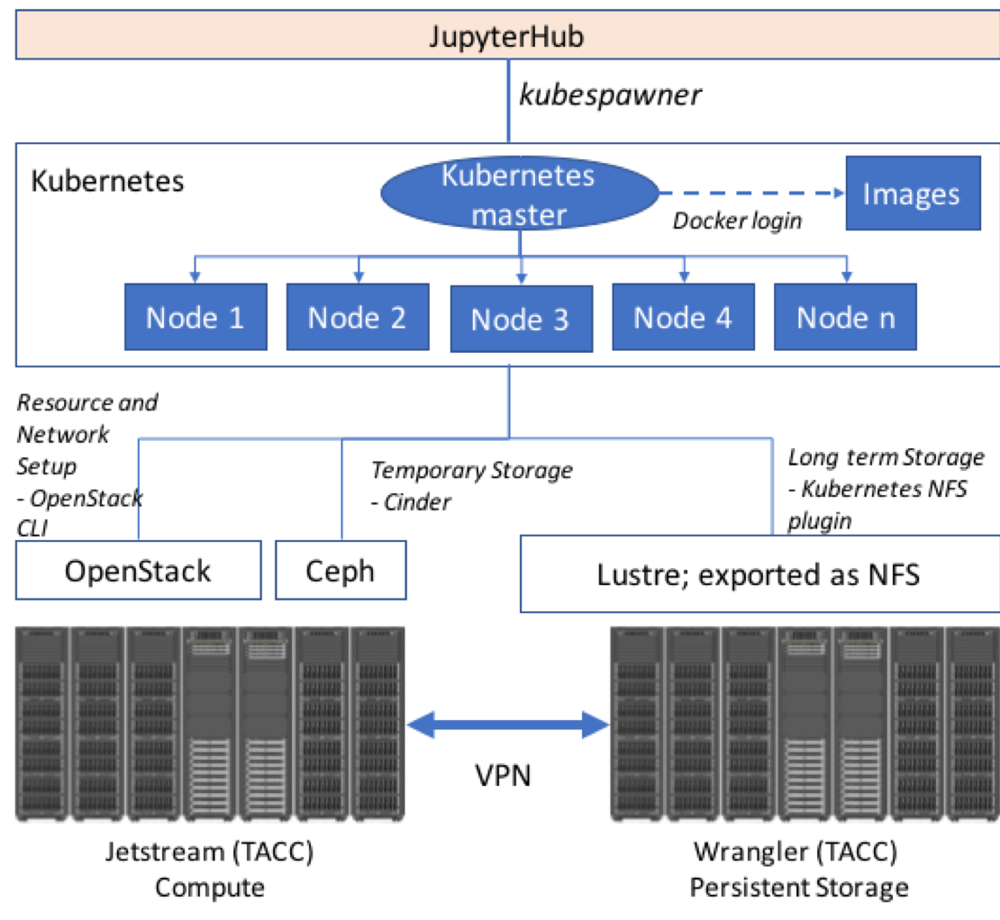

Unidata on the XSEDE Jetstream Cloud.

### Prototype Design for Jupyterhub on Jetstream and Wrangler ###
A scalable solution that leverages Openstack, Kubernetes, Docker and Jupyterhub technologies for delivering a powerful tool for user training and next-generation workforce development in atmospheric sciences.

